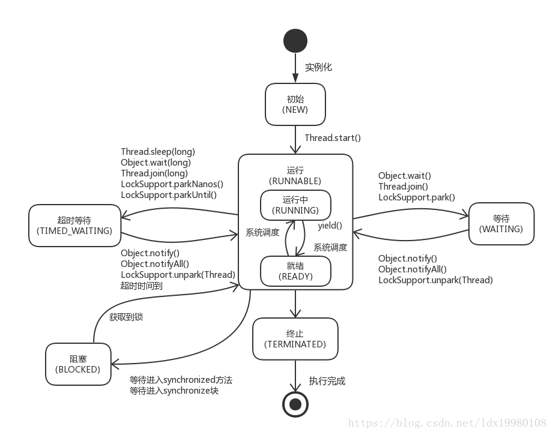

[TOC]


## 1、Process和Thread


|    区别     |                             进程                             |                             线程                             |
| :---------: | :----------------------------------------------------------: | :----------------------------------------------------------: |
|  根本区别   |                      作为资源分配的单位                      |                       调度和执行的单位                       |
| 开       销 | 每个进程有独立的代码空间和数据空间（进程上下文），进程间的切换会有较大的开销 | 线程可以看做是轻量级的进程，同一类线程共享代码和数据空间，每个线程有独立的运行栈和程序计数器（PC),线程切换的开销小 |
|  所处环境   |            在操作系统中能同时运行多个任务（程序）            |             在同一应用程序中有多个顺序流同时执行             |
|  分配内存   |          系统在运行时会为每个进程分配不同的内存区域          | 除了CPU之外，不会为线程分配内存，（线程所使用的资源是他所属的进程的资源），线程组只能共享资源 |
|  包含关系   | 没有线程的进程可以被看做单线程的，如果一个进程内有多个线程，则执行过程不是一条线的，而是多条线（线程）同时完成 | 线程是进程的一部分，所以线程有的时候被称为是轻权进程，或者轻量级进程 |

> 注意：很多多线程是被模拟出来的，真正的多线程是指有多个CPU，即多核，如服务器。如果是模拟出来的多线程，即在一个CPU的情况下，在同一个时间点，CPU只能执行一个代码，因为切换的很快，所以就有同时执行的错觉


## 2、概念

- 线程就是独立的执行路径，任何线程都是独立平行的
- 在程序运行时候，即使没有创建线程，后台也会存在多个线程，如GC线程，主线程
- main()称为主线程，为系统的入口点，用于执行整个程序
-  线程的执行顺序CPU随机调度 
- 对于同一份资源来说，会存在资源抢夺的问题，需要加入并发控制
- 线程会带来额外的开销，如：CPU调度时间，并发控制开销
- 每个线程在自己的工作内存中交互，加载和存储主内存控制不当会造成数据不一致


## 3、创建线程

- 继承Thread类
- 实现Runnable接口
-  通过 Callable 和 Future 创建线程 

### 3.1 、继承Thread类

​	继承类必须重写 run() 方法，该方法是新线程的入口点。它也必须调用 start() 方法才能执行。

​	该方法尽管被列为一种多线程实现方式，但是本质上也是实现了 Runnable 接口的一个实例。

```java
public class Thread extends Object implements Runnable
```

> **示例**

```java
public class StartThread extends Thread {

    @Override
    public void run() {
        for (int i = 0; i < 2000; i++) {
            System.out.println("一边听歌");
        }
    }


    public static void main(String[] args) {

        //创建子类对象
        StartThread st = new StartThread();
        //启动
        st.start();

        for (int i = 0; i < 2000; i++) {
            System.out.println("一边coding");
        }

    }
}
```

> **Tips**

- 执行线程必须调用start(),加入到调度器中
- 不一定立即执行，系统安排调度分配执行
- 直接调用run()不是开始多线程，是普通方法的调用


### 3.2、实现Runnable接口

***推荐：***

- 避免单继承的局限性，优先使用接口
- 方便资源共享

```java
public class StartRun implements Runnable {

    @Override
    public void run() {
        for (int i = 0; i < 2000; i++) {
            System.out.println("一边听歌");
        }
    }

    public static void main(String[] args) {
        //创建实现类对象
        StartRun sr = new StartRun();
        //创建代理类对象
        Thread t = new Thread(sr);
        //启动
        t.start();
        
        //使用匿名对象
        //new Thread(new StartRun()).start();

        for (int i = 0; i < 2000; i++) {
            System.out.println("一边coding");
        }
    }
}
```


### 3.3、通过 Callable 和 Future 创建线程 ( JUC ）

1.  创建 Callable 接口的实现类，并实现 call() 方法，该 call() 方法将作为线程执行体，并且有返回值。
2.  创建 Callable 实现类的实例，使用 FutureTask 类来包装 Callable 对象，该 FutureTask 对象封装了该 Callable 对象的 call() 方法的返回值。
3.  使用 FutureTask 对象作为 Thread 对象的 target 创建并启动新线程。
4.  调用 FutureTask 对象的 get() 方法来获得子线程执行结束后的返回值。

```java
public class StartCall implements Callable<Boolean> {
    private String name;

    @Override
    public Boolean call() throws Exception {
        System.out.println(name);

        return Boolean.TRUE;
    }

    public StartCall(String name) {
        this.name = name;
    }

    public static void main(String[] args) 
        		throws ExecutionException, InterruptedException {

        StartCall sr = new StartCall("sr1");
        StartCall sr2 = new StartCall("sr2");
        StartCall sr3 = new StartCall("sr3");


        //1、创建执行服务
        ExecutorService ser = Executors.newFixedThreadPool(3);
        //2、提交执行
        Future<Boolean> future1 = ser.submit(sr);
        Future<Boolean> future2 = ser.submit(sr2);
        Future<Boolean> future3 = ser.submit(sr3);
        //获取结果
        boolean r1 = future1.get();
        boolean r2 = future2.get();
        boolean r3 = future3.get();
        //关闭服务
        ser.shutdownNow();


        System.out.println(r1);

    }
}
```


### 3.4、lamda表达式

- 避免匿名内部类定义过多
- 实质数组函数式编程的概念

```java
//匿名内部类 必须借助接口或者父类
new Thread(new Runnable() {
    @Override
    public void run() {
        for (int i = 0; i < 2000; i++) {
            System.out.println("匿名内部类 必须借助接口或者父类");
        }
    }
}).start();

//lamda表达式
new Thread(() -> {
    for (int i = 0; i < 2000; i++) {
        System.out.println("匿名内部类 必须借助接口或者父类");
    }
}
).start();
```

**简化3.2**

```java
public static void main(String args[]) {
    new Thread(() -> {
         for (int i = 0; i < 2000; i++) {
            System.out.println("一边听歌");
        }
    }).start();
    
    new Thread(() -> System.out.println("一边自闭")).start;
}
```


## 4、线程状态

```java
 public enum State {
        /**
         * 新建线程
         * Thread state for a thread which has not yet started.
         * 当前还未启动的线程
         */
		  NEW,

        /**
       	 * 可运行状态线程
         * Thread state for a runnable thread.  A thread in the runnable
         * state is executing in the Java virtual machine but it may 
         * be waiting for other resources from the operating system
         * such as processor.
         * 可运行状态的线程是在jvm中正在执行的线程状态。但该线程
         * 可能正在等待操作系统资源（如处理器）
         */
        RUNNABLE,

        /**
         * 阻塞状态线程
         * Thread state for a thread blocked waiting for a monitor lock.
         * A thread in the blocked state is waiting for a monitor lock
         * to enter a synchronized block/method or
         * reenter a synchronized block/method after calling
         * {@link Object#wait() Object.wait}.
         * 阻塞状态的线程等待一个监视器锁以进入一个同步代码块/同步方法，
         * 或者该线程在调用wait()方法后重如该同步代码块/同步方法。
         */
        BLOCKED,

        /**
         * 等待状态的线程
         * Thread state for a waiting thread.
         * A thread is in the waiting state due to calling one of the
         * following methods:
         * <ul>
         *   <li>{@link Object#wait() Object.wait} with no timeout</li>
         *   <li>{@link #join() Thread.join} with no timeout</li>
         *   <li>{@link LockSupport#park() LockSupport.park}</li>
         * </ul>
         * 当线程调用Object.wait()方法，Thread.join()方法和
         * LockSupport.park()方法是会造成线程等待
         *
         * <p>A thread in the waiting state is waiting for another thread to
         * perform a particular action.
         * 等待状态的线程会期待另一个线程执行特定动作。
         * For example, a thread that has called <tt>Object.wait()</tt>
         * on an object is waiting for another thread to call
         * <tt>Object.notify()</tt> or <tt>Object.notifyAll()</tt> on
         * that object. A thread that has called <tt>Thread.join()</tt>
         * is waiting for a specified thread to terminate.
         * 例如，一个线程调用wait方法后，需要别的线程调用notify方法将其唤醒；
         * 一个线程调用Thread.join()方法后需等待特定线程终止。
         */
        WAITING,

        /**
         * 定时等待状态线程
         * Thread state for a waiting thread with a specified waiting time.
         * 定时等待状态是该线程等待特定等待时间
         * A thread is in the timed waiting state due to calling one of
         * the following methods with a specified positive waiting time:
         * <ul>
         *   <li>{@link #sleep Thread.sleep}</li>
         *   <li>{@link Object#wait(long) Object.wait} with timeout</li>
         *   <li>{@link #join(long) Thread.join} with timeout</li>
         *   <li>{@link LockSupport#parkNanos LockSupport.parkNanos}</li>
         *   <li>{@link LockSupport#parkUntil LockSupport.parkUntil}</li>
         * </ul>
         * 当调用Thread.sleep、Object.wait(long timeout)、Thread.join(long timeout)
         * LockSupport.parkNanos、LockSupport.parkUntil这些方法时，
         * 会造成线程进入timed waiting状态
         */
        TIMED_WAITING,

        /**
         * 终止状态的线程
         * Thread state for a terminated thread.
         * The thread has completed execution.
         * 终止状态的线程意味着线程已经执行结束。
         */
        TERMINATED;
    }
```

  

### 4.1、线程状态描述

1. **初始状态**

  通过继承Thread类或实现Runnable接口得到一个线程类，new一个实例出来，这个生成的线程就进入了初始状态。

  该线程没有被start()启动，但也不代表调用了start()状态就立即改变状态，中间还有一些步骤，如果在这个启动的过程中有另一个线程来获取它的状态，其实是不确定的，要看那些中间步骤是否已经完成了。

2. **运行状态**

  -  **就绪状态** 

    包括了操作系统线程状态中的Running和Ready，也就是处于此状态的线程可能正在运行，也可能正在等待系统资源，如等待CPU为它分配时间片。就绪状态有资格运行，但是要等到调度程序选到，不选到永远都是就绪状态。

    ***进入就绪状态的几种方式：***

    - 新建的线程调用start()方法进入就绪状态。
    - 运行中线程时间片用完了，调用该线程的yield()方法进入就绪状态。
    - 等待锁资源的线程拿到对象锁后进入就绪状态。
    - 当前线程sleep()结束、其他线程join()结束、等待用户输入完毕、某个线程拿到对象锁，这些线程也将进入就绪状态。

  - **运行中状态**

      线程调度程序从可运行线程池中选择一个线程作为当前线程时，该线程所处的状态。
      
      

3. **阻塞状态**
    线程阻塞在进入synchronized关键字修饰的方法或代码块(获取锁)时的状态。

    
    
4. **等待状态**
    线程需要等待其他线程做通知或中断，如果没有就要一直等待下去。

    比如：
    Thread1获取lock对象锁，之后调用wait()方法进入等待队列，而同时会释放掉对象锁，状态为Waiting。
    Thread2获取lock对象锁后调用notify()方法通知一个等待线程，将其移到同步队列，然后继续执行自己Synchronized中的代码，当释放掉lock对象锁后，Thread1线程才有可能重新获取lock并执行先前未完成的代码（是否通知了Thread1要看线程调度器有没有选择Thread1）。

    阻塞与等待的区别：

    阻塞状态是等待着获取到一个排他锁，进入阻塞状态都是被动的，离开阻塞状态是因为其它线程释放了锁，不阻塞了。
    等待状态是在等待一段时间或者某个唤醒动作的发生，进入等待状态是主动的。

    

5. **超时等待**
    与等待类似，但可以在指定的时间内自行返回。

  

6. **终止状态**
    当线程的run()方法完成时或主线程的main()方法完成时，我们就认为该线程终止了。这个线程对象也许是活的，但它不是一个线程。
    线程一旦终止就不能复生。在一个终止的线程上调用start()方法，会抛出java.lang.IllegalThreadStateException异常。

## 面试题

### 1、Callable和Runnable的区别

**相同点：**

1. 两者都是接口
2. 两者都需要调用Thread.start启动线程

**不同点：**

1. callable的核心是call方法，允许返回值，runnable的核心是run方法，没有返回值
2. call方法可以抛出异常，但是run方法不行
3. 因为runnable是java1.1就有了，所以他不存在返回值，后期在java1.5进行了优化，就出现了callable，就有了返回值和抛异常
4. callable和runnable都可以应用于executors。而thread类只支持runnable


